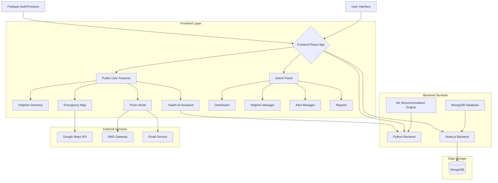
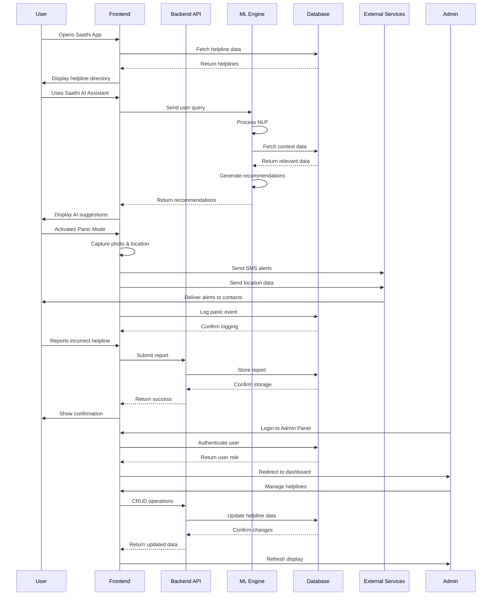
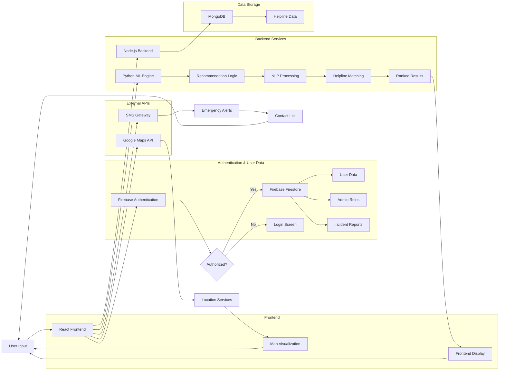
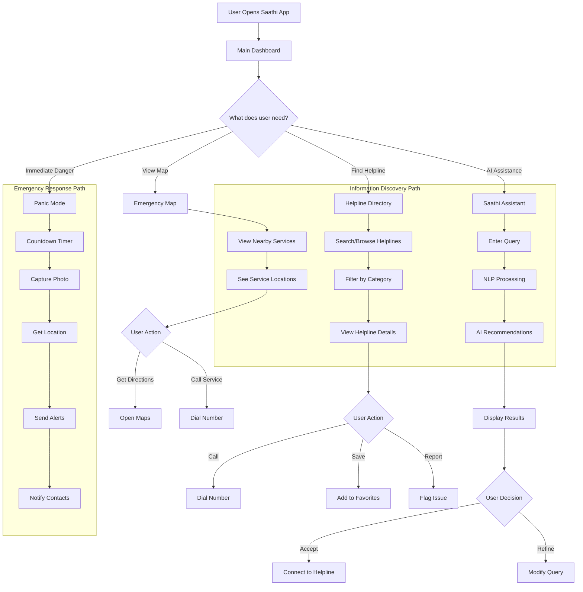
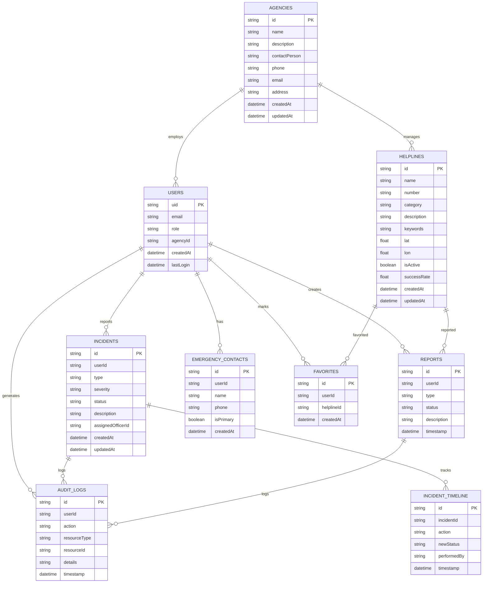
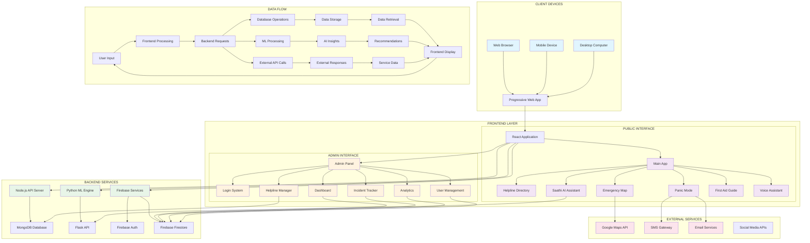

# Admin Panel Architecture & Module Structure

## 1. Overview
The Admin Panel is a secure, role-based interface for managing the Saathi Helpline ecosystem. It is built within the existing React application but isolated in the `src/admin` directory.

## 2. Security Model
- **Authentication**: Firebase Authentication (Email/Password).
- **Authorization**: Role-Based Access Control (RBAC) stored in Firestore `users` collection.
- **Roles**:
    - **Super Admin**: Full system access. Can manage other admins.
    - **Admin**: Can manage helplines, agencies, and view global reports.
    - **Agency Officer**: Restricted access. Can only manage their specific agency's profile and view relevant alerts/reports.

## 3. Folder Structure
```
src/
  admin/
    components/         # Reusable admin UI components
      AdminLayout.js    # Sidebar + Header wrapper
      StatCard.js       # Dashboard widget
      RoleRoute.js      # Protected Route wrapper
    context/
      AdminAuth.js      # Context for admin session & role state
    pages/
      AdminLogin.js     # Login screen
      Dashboard.js      # Main overview
      Helplines.js      # CRUD for helplines
      Agencies.js       # Agency management
      Reports.js        # User report viewer
    utils/
      permissions.js    # Role checking logic
```

## 4. Data Model (Firestore)
### `users` (Collection)
```json
{
  "uid": "user_123",
  "email": "admin@saathi.org",
  "role": "admin", // 'super-admin', 'admin', 'agency-officer', 'user'
  "agencyId": "agency_abc" // Optional, for officers
}
```

### `reports` (Collection)
```json
{
  "id": "rep_001",
  "type": "missing_person",
  "status": "open", // 'open', 'investigating', 'resolved'
  "location": { "lat": 12.97, "lon": 77.59 },
  "timestamp": "2025-12-02T10:00:00Z"
}
```

## 5. Implementation Steps
1.  **Deploy Rules**: `firebase deploy --only firestore:rules`
2.  **Create Admin User**: Manually set `role: 'super-admin'` in Firestore for the first user.
3.  **Integrate**: Wrap admin routes in `App.js` with `<RoleRoute allowedRoles={['admin']} />`.

## 6. Integrated System Architecture Diagram



## 7. Component Interaction Flow Diagram



## 8. Data Flow Architecture Diagram



## 9. User Journey and Emergency Response Flow



## 10. Entity Relationship Diagram



## 11. Complete Integrated System Diagram

